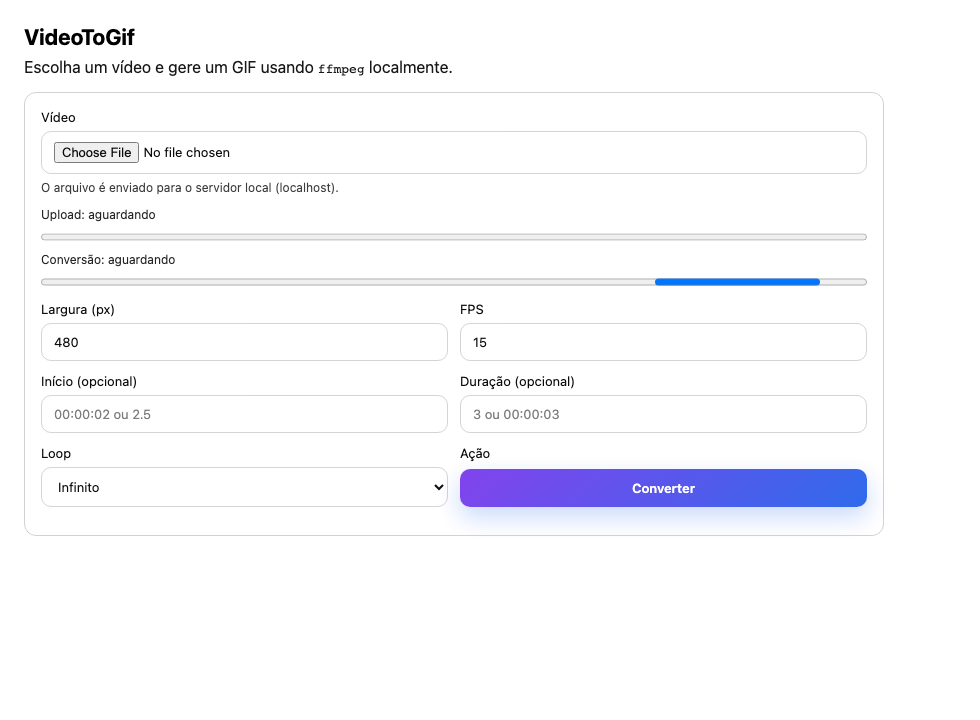

# VideoToGif (TypeScript)

Converte vídeos em GIF localmente usando `ffmpeg`. Inclui:

- CLI (`videotogif`) para converter via terminal
- Frontend web simples (upload + progresso + download)



## Requisitos

- Node.js (recomendado: 18+)
- `ffmpeg` (e idealmente `ffprobe`) disponível no PATH

### Instalar ffmpeg

- macOS (Homebrew): `brew install ffmpeg`
- Ubuntu/Debian: `sudo apt-get install ffmpeg`
- Windows (Chocolatey): `choco install ffmpeg`

## Instalação

```bash
npm install
```

## Rodar o frontend (web)

1) Build + iniciar servidor:

```bash
npm run web
```

2) Abrir:

`http://localhost:3000`

### Como funciona

- Você seleciona um vídeo no navegador e clica em **Converter**
- O upload mostra progresso real
- A conversão mostra progresso real (%), calculado a partir do progresso do `ffmpeg`
- Ao terminar, o GIF fica disponível para download e preview

### Trocar porta

```bash
PORT=3001 npm run web
```

## Usar via CLI (terminal)

### Converter (com build automático)

```bash
npm run convert -- input.mp4
```

Se você não passar `output`, ele cria `input.gif` na mesma pasta.

### Converter (build manual)

```bash
npm run build
node dist/cli.js input.mp4 output.gif --width 640 --fps 20
```

### Ajuda / opções

```bash
npm run help
```

Opções principais:

- `--width <px>`: largura do GIF (default: 480)
- `--fps <n>`: FPS do GIF (default: 15)
- `--start <time>`: início (ex: `00:00:02` ou `2.5`)
- `--duration <time>`: duração (ex: `3` ou `00:00:03`)
- `--loop <0|1>`: `0` loop infinito (default), `1` sem loop
- `--overwrite`: sobrescrever saída

## Instalar como comando global (opcional)

Dentro deste projeto:

```bash
npm run build
npm link
videotogif input.mp4
```

Para remover o link:

```bash
npm unlink -g video-to-gif
```

## Screenshot do frontend (opcional)

Se quiser regenerar a imagem do README:

```bash
npm run screenshot
```

Obs: isso baixa o Chromium do Playwright na primeira execução.

## Troubleshooting

### “ffmpeg não encontrado/indisponível”

- Verifique se `ffmpeg -version` funciona no terminal
- Reinstale o ffmpeg e reabra o terminal

### Progresso travado/0%

- O progresso da conversão depende do `ffprobe` (que vem junto com o ffmpeg na maioria das instalações).
  Se `ffprobe` não estiver disponível, a conversão roda, mas o percentual pode ficar menos preciso.

### Porta 3000 em uso

```bash
PORT=3001 npm run web
```
